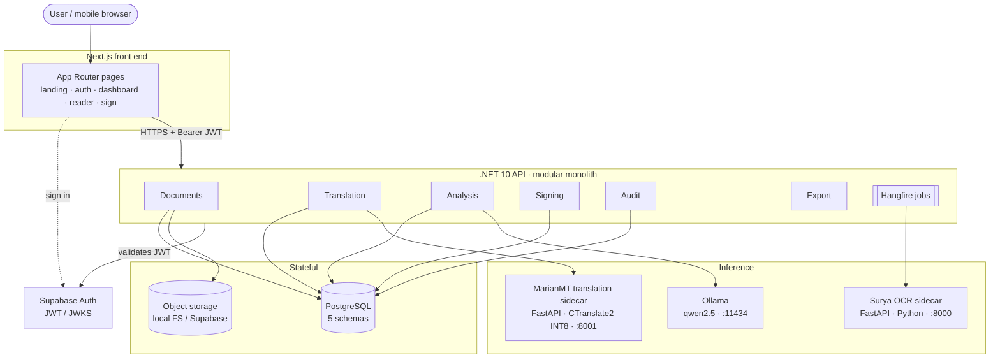
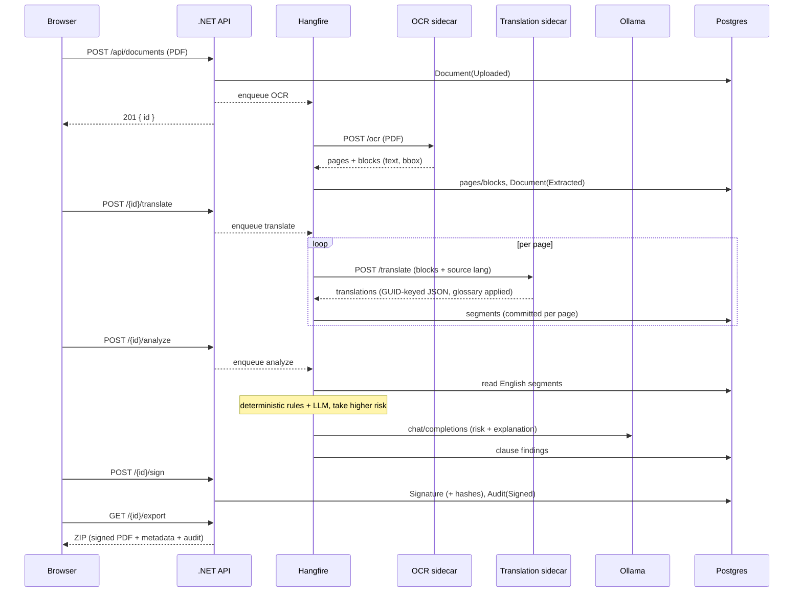
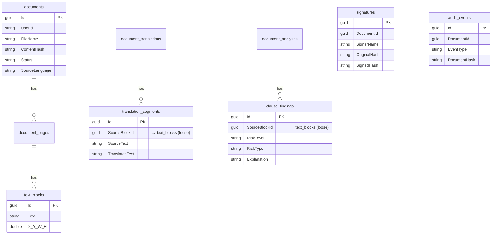
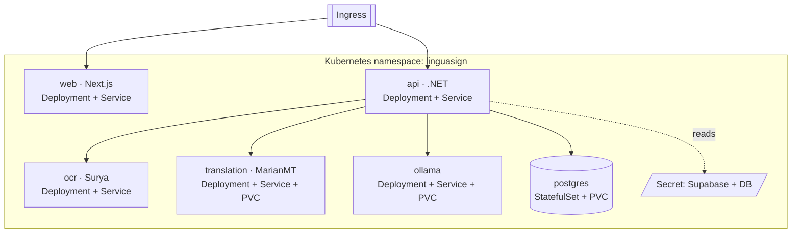

# Architecture

LinguaSign is a **modular monolith** on the backend with a separate Next.js front end and two
small Python sidecars — one for OCR, one for translation. The whole thing is designed to run on
one machine for validation and to be lifted onto a server (or Kubernetes) without code changes —
the only things that move are connection strings and base URLs.

The deliberate non-goals are worth stating up front, because they shaped everything: no
microservices, no message broker, no cloud lock-in. A solo project doesn't have the problems
those solve, and they'd have cost more than they returned.

## System overview

Each backend module owns its own EF Core `DbContext` and Postgres schema
(`documents`, `translation`, `signing`, `audit`, `analysis`). Modules talk to each other through
public service interfaces (`IDocumentService`, `ITranslationService`, `IAuditService`), never by
reaching into another module's tables. That keeps the seams honest, so if one module ever needs
to become its own service the cut is already drawn.

The front end never holds secrets beyond the public Supabase anon key. It signs in against
Supabase directly, then sends the resulting JWT to the .NET API as a bearer token; the API
validates it against Supabase's JWKS.

## How a document is processed

Uploading kicks off a short, linear pipeline. It's driven by Hangfire background jobs and the
front end polls for status — there's no websocket, just `GET` polling, which is plenty for a
per-document flow.

Three things in here are load-bearing:

- **Translation uses a purpose-built MT model, not a general LLM.** MarianMT
  (`Helsinki-NLP/opus-mt-ko-en`) via CTranslate2 INT8 is 78 MB, uses ~500 MB RAM, and starts in
  2 seconds. This frees the rest of system memory for OCR and risk analysis and makes the whole
  stack viable on a 16 GB machine.
- **Translation runs one page at a time, never the whole document in one call.** Page-level
  batching lets segments stream into the reader as each page finishes, so the first page is
  readable in seconds.
- **Risk detection is hybrid.** Deterministic keyword rules run alongside the LLM and the higher
  risk wins. For a tool people use before signing, a missed high-risk clause is the worst
  outcome, so the rules act as a floor the model can't undershoot.

## Data model

The `SourceBlockId` columns are the spine of the whole product. A translation segment and a risk
finding both point back to the OCR text block they came from, which is what lets the reader draw
the "kinship" line between a Korean clause and its English translation, and tint the right block
when a risk is flagged. They're loose references (plain GUIDs, no cross-schema foreign key) on
purpose — that's the price of keeping each module's schema independent.

## Tech choices, briefly

| Area | Choice | Why |
|------|--------|-----|
| Backend | .NET 10, modular monolith | One deployable, clean module seams |
| Async | Hangfire (Postgres-backed) | The pipeline is a linear per-document job, not a stream |
| OCR | Surya (self-hosted) | Strong layout + Korean; runs on the same box |
| Translation | MarianMT via CTranslate2 INT8 | 78 MB model, ~500 MB RAM, 2 s startup; purpose-built for translation, not a general LLM. Legal-term glossary applied post-decode. `Translation:Engine=ollama` reverts to qwen2.5 |
| Risk analysis | Ollama (`qwen2.5:7b`) | Needs reasoning, not just translation; hybrid with deterministic keyword rules |
| Auth/DB/storage | Supabase | One provider for auth + Postgres + storage |
| PDF stamping | PdfSharp | MIT-licensed; avoids iText's AGPL |
| Front end | Next.js 16 / React 19 | App Router, server components where useful |

## Deployment topology

The same containers run on a laptop, a single VM, or Kubernetes. On k8s it looks like this:

Manifests and step-by-step guides for local, cloud, and Kubernetes are in
[DEPLOY.md](DEPLOY.md).
